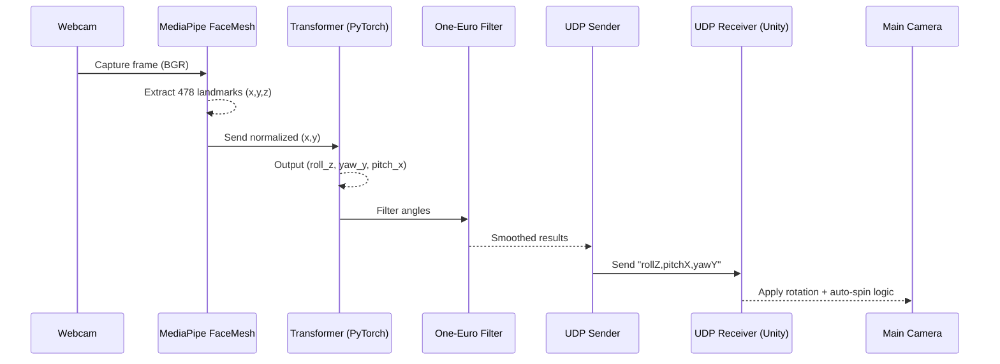

# Face Tracking Semi-Immersive VR  
**Seonghwan Lim, Illinois Institute of Technology**  

---

### Abstract

This project transforms a **standard webcam** into a **real-time head-pose controller** for Unity,  
enabling a *semi-immersive VR* experience without requiring head-mounted displays (HMDs), sensors, or markers.  

Using **MediaPipe Face Landmarker**, the system extracts **478 facial landmarks** from live video frames and estimates  
**Euler angles (Roll, Pitch, Yaw)** through a lightweight **Transformer-based regression model** trained on the  
**BIWI Kinect Head Pose Database**.  

To ensure smooth and natural motion, the predicted angles are stabilized using the **One-Euro Filter**  
and transmitted via **UDP** to a Unity scene, where a C# script maps them to camera rotations in real time.  

This low-cost and portable setup demonstrates that **marker-free, webcam-only head tracking**  
can approximate the responsiveness of professional VR hardware with less than **10 ms latency**,  
making it suitable for rapid VR/AR prototyping, educational visualization, and interactive installations.  

> **Keywords:** Head Pose Estimation · MediaPipe Face Landmarker · Transformer Regression ·  
> One-Euro Filter · Realtime Unity Integration · BIWI Kinect Dataset

---

## Project Overview

Most virtual-reality (VR) systems require **head-mounted displays (HMDs)** or specialized sensors,  
making them expensive and impractical for small labs, classrooms, or hobby projects.  
This work demonstrates that a **single, off-the-shelf webcam** is sufficient to deliver  
a *semi-immersive VR experience* — allowing users to look around a 3D world  
simply by turning their head.

The system continuously detects **3D facial landmarks** from live webcam video using  
**MediaPipe Face Landmarker**, predicts the head’s **Euler angles (Roll, Pitch, Yaw)**  
through a lightweight **Transformer network**, and transmits the results to **Unity** in real time.  
Unity’s camera then rotates according to the user’s head motion, creating the feeling  
of peering through a virtual window into another world.

This architecture achieves smooth, low-latency head-pose control (≈10 ms)  
without dedicated hardware — ideal for rapid **VR/AR prototyping**,  
**virtual classrooms**, and **interactive exhibitions**.

---

### System Concept Diagram

<p align="center">
  
  <br>
  <em>Figure 1. Overview of the semi-immersive face-tracking VR system using only a webcam.</em>
</p>

**Workflow Summary**

1. **Webcam Capture** → Live 720p video feed  
2. **MediaPipe Face Mesh** → Extracts 478 facial keypoints  
3. **Transformer Model** → Regresses Euler angles *(Roll, Pitch, Yaw)*  
4. **One-Euro Filter** → Smooths temporal jitter  
5. **UDP Transmission** → Sends three floats to Unity  
6. **Unity C# Receiver** → Rotates Main Camera accordingly  

---

### Why It Matters
- **Low-cost & portable:** Runs on any laptop webcam  
- **Marker-free:** No fiducial markers or external sensors required  
- **Realtime:** < 10 ms total latency with CPU-only inference  
- **Expandable:** Easily integrated with facial animation or avatar control  

---

## System Overview

The full system integrates **Python (MediaPipe + Transformer)** for head-pose estimation  
and **Unity (C#)** for visualization, connected through **UDP streaming**.  
The table below summarizes each functional stage of the pipeline.

| Stage | Component | Description |
|--------|------------|-------------|
| **1. Capture** | Webcam | Captures 720p/30 FPS RGB frames. |
| **2. Face Landmark Extraction** | MediaPipe Face Mesh | Detects 478 3D facial landmarks in each frame. |
| **3. Angle Estimation** | Transformer Model | Predicts Euler angles *(Roll, Pitch, Yaw)* from normalized landmark coordinates. |
| **4. Temporal Filtering** | One-Euro Filter | Removes high-frequency jitter while preserving responsiveness. |
| **5. Communication** | UDP Socket | Streams three floats — `rollZ,pitchX,yawY` — to Unity in real time. |
| **6. Rendering** | Unity (C# Script) | Rotates the Main Camera according to received angles; applies soft auto-spin beyond ±30°. |

---

### End-to-End Data Flow

```mermaid
flowchart LR
    A["Webcam Capture\n(OpenCV)"] --> B["MediaPipe FaceMesh\n478 Landmarks"]
    B --> C["Box Normalize\n(x,y) Coordinates"]
    C --> D["Transformer Model\nPredict Roll / Pitch / Yaw"]
    D --> E["One-Euro Filter\nSmooth Angles"]
    E --> F["UDP Transmission"]
    F --> G["Unity Receiver (C#)\nCamera Rotation"]

---

## Face Landmark Detection (MediaPipe)

This project leverages **Google MediaPipe’s Face Landmarker Task** to extract  
**478 three-dimensional facial landmarks** in real time from a live webcam feed.  
These landmarks provide rich geometric information that allows precise estimation of **head orientation (Euler angles: roll, pitch, yaw)**.

---

### Overview

| Feature | Description |
|----------|-------------|
| **Input types** | Still images, decoded video frames, or live webcam stream |
| **Outputs** | Face bounding boxes, 478 3D landmarks, optional 52 blendshape scores (facial expressions), and optional facial transformation matrices |
| **Model bundle** | 1️⃣ *BlazeFace Short-Range* – face detection<br>2️⃣ *FaceMesh-V2* – 478 landmark regression<br>3️⃣ *Blendshape Predictor* – facial expression coefficients |
| **Typical configuration (Python)** | `num_faces=1`, `refine_landmarks=True`,<br>`min_face_detection_confidence=0.5`,<br>`min_tracking_confidence=0.5` |
| **Running mode** | `LIVE_STREAM` (used in this project) |
| **Average performance** | ~30 FPS on a 720p webcam stream |

---

### Model Structure

| Stage | Model | Purpose | Output |
|--------|--------|----------|--------|
| **1. Face Detection** | *BlazeFace Short-Range* | Detects the presence and bounding box of a face | 6 key facial points + bounding box |
| **2. Face Mesh Regression** | *FaceMesh-V2* | Predicts dense 3D facial geometry | 478 landmarks (x, y, z) |
| **3. Blendshape Prediction** | *Blendshape Model* | Estimates 52 expression coefficients | Blendshape scores |
| **4. Transformation Matrix (optional)** | — | Transforms canonical face model to detected face geometry | 4×4 matrix |

---

### Visualization

The MediaPipe FaceMesh model outputs 478 landmarks covering the eyes, mouth, lips, and facial contour.  
Each landmark provides (x, y, z) coordinates normalized to the input image.


*(Image courtesy of Google MediaPipe Face Landmarker guide.)*

---

### Reference

- [Official MediaPipe Face Landmarker Guide](https://ai.google.dev/edge/mediapipe/solutions/vision/face_landmarker)  
- Bazarevsky et al., *BlazeFace: Sub-millisecond Neural Face Detection on Mobile GPUs*, Google Research (2019)  
- Casiez et al., *The One Euro Filter: A Simple Speed-Based Low-Pass Filter for Noisy Input in Interactive Systems*, CHI 2012  

---

## Training Dataset — Biwi Kinect Head Pose Database

The Transformer model used in this project was trained on the  
**[Biwi Kinect Head Pose Database](https://www.kaggle.com/datasets/kmader/biwi-kinect-head-pose-database/data)**  
(*Fanelli et al., IJCV 2013*), one of the most widely used benchmark datasets for **real-time 3D head pose estimation**.

---

### Dataset Overview

| Property | Description |
|-----------|-------------|
| **Modality** | RGB + Depth (Kinect sensor) |
| **Resolution** | 640 × 480 pixels |
| **Frames** | ≈ 15,000 frames |
| **Subjects** | 20 individuals (14 males, 6 females; 4 recorded twice) |
| **Capture setup** | Recorded at ~1 meter distance; subjects freely rotated their heads to cover wide pose angles |
| **Head pose range** | Yaw ±75°, Pitch ±60° |
| **Annotations** | 3D head center position and Euler rotation angles per frame |
| **Purpose** | Designed for *frame-by-frame pose estimation*, not continuous tracking |
| **License** | Research use only |

---

### Dataset Structure

Each subject directory contains synchronized RGB, depth, and annotation files:

```markdown
/<subject>/
 ├─ frame_XXXX_rgb.png        # RGB image (640×480)
 ├─ frame_XXXX_depth.png      # Depth map (grayscale)
 ├─ frame_XXXX_pose.txt       # 3×3 rotation matrix R and 3D translation vector t
```
---

### Citation

If you use this dataset in any research, please cite the following paper:

> Fanelli, G., Dantone, M., Gall, J., Fossati, A., & Van Gool, L.  
> *Random Forests for Real Time 3D Face Analysis.*  
> *International Journal of Computer Vision (IJCV)*, 101(3), 437–458, 2013.  
> DOI: [10.1007/s11263-012-0510-2](https://doi.org/10.1007/s11263-012-0510-2)

```bibtex
@article{fanelli_IJCV,
  author  = {Fanelli, Gabriele and Dantone, Matthias and Gall, Juergen
             and Fossati, Andrea and Van Gool, Luc},
  title   = {Random Forests for Real Time 3D Face Analysis},
  journal = {Int. J. Comput. Vision},
  volume  = {101},
  number  = {3},
  pages   = {437--458},
  year    = {2013}
}
```

### References

- Kaggle: [Biwi Kinect Head Pose Database](https://www.kaggle.com/datasets/kmader/biwi-kinect-head-pose-database/data)  
- Fanelli et al., *Random Forests for Real Time 3D Face Analysis*, IJCV, 2013.

## Key Modules

| File | Description |
|------|--------------|
| **filters.py** | Implements the *One-Euro Filter* (Casiez et al., CHI 2012) to smooth jitter in Euler angles by adapting cutoff frequency based on motion speed. |
| **help.py** | Utility functions for coordinate normalization, rotation matrix construction (`rotmat_zyx`), and visualization (`draw_axes`). |
| **transformer.py** | Defines a 3-layer, 4-head Transformer encoder that predicts Euler angles `(roll, yaw, pitch)` from 478 facial landmarks. |
| **unity.py** | The main Python runtime: captures webcam frames, runs MediaPipe Face Mesh, infers pose angles via Transformer, smooths with One-Euro filter, and sends UDP packets to Unity. |
| **unity_script/face_tracking.cs** | Unity C# receiver: listens for UDP packets, applies roll–pitch–yaw to camera rotation, and adds an *auto-spin* mechanism to prevent gimbal flips beyond ±30°. |

---

## End-to-End Pipeline

```mermaid
flowchart LR
    subgraph TRAIN[Offline Training (BIWI)]
      A1[BIWI RGB + Pose Labels] --> A2[Face Mesh Landmark Extraction]
      A2 --> A3[Box Normalization (x,y)]
      A3 --> A4[Transformer Regression Training<br/>(Roll, Yaw, Pitch)]
      A4 --> A5[(transformer.pth)]
    end

    subgraph INFER[Online Inference (Python Runtime)]
      B1[Webcam Frame] --> B2[MediaPipe Face Mesh (478 landmarks)]
      B2 --> B3[Normalization (x,y)]
      B3 --> B4[Transformer Prediction]
      B4 --> B5[One-Euro Filter<br/>Adaptive Smoothing]
      B5 --> B6[UDP Packet (rollZ,pitchX,yawY)]
    end

    subgraph UNITY[Unity Engine]
      C1[UDP Receiver (C#)] --> C2[Auto-Spin Logic ±30°]
      C2 --> C3[Main Camera<br/>localEulerAngles]
    end

    A5 -. pretrained weights .-> B4
    B6 --> C1
```

**Description:**

Left: Transformer trained on BIWI dataset  
Center: Realtime Python pipeline (MediaPipe → Transformer → Filter → UDP)  
Right: Unity runtime applying the pose to the camera

---

## Real-Time Sequence



**Purpose:** illustrates the real-time interaction loop between Python (pose estimation) and Unity (rendering).

---

## Training Pipeline

```mermaid
flowchart TB
    D1[BIWI RGB Frames] --> P1[MediaPipe Face Mesh<br/>Landmark Extraction]
    D2[BIWI Ground Truth Angles] --> J[Preprocessing / Alignment]
    P1 --> N1[Box Normalization (x,y)]
    N1 --> M1[Transformer Training<br/>(MSE Regression)]
    J --> M1
    M1 --> W[(transformer.pth)]
```

**Training summary:**

Input: RGB frames from BIWI → 2D landmarks  
Target: Euler angles (roll, pitch, yaw)  
Loss: Mean Squared Error (MSE)  
Output: transformer.pth model weights used by unity.py.

---

## Performance

| Metric | Result | Description |
|---------|---------|-------------|
| Model Inference (CPU) | ~1.2 ms / frame | Tested on Intel i7 laptop CPU |
| Total Latency | < 10 ms | Including MediaPipe + Transformer + UDP |
| Unity Render Rate | 30–60 FPS | Real-time rotation without frame drops |
| Yaw Error (BIWI test) | ±3.5° | Average mean absolute error |
| Stability | Smooth under ±75° yaw | No gimbal flips due to auto-spin handling |

**Notes:**

The One-Euro Filter significantly reduces jitter while maintaining responsiveness.  
Full system latency (capture → Unity render) stays below 10 ms, enabling near real-time motion reflection.

---

## Applications

| Category | Example Use |
|-----------|--------------|
| Low-cost VR/AR prototyping | Test immersive interfaces without expensive HMDs. |
| Virtual classrooms | Instructor and students share synchronized semi-immersive perspectives. |
| Interactive installations / museums | Enable natural interaction in public settings without wearable devices. |
| 3D avatar control | Drive lightweight facial animation rigs or cameras from webcam input. |

---

## Folder Structure

```markdown
project_root/
├─ python/
│  ├─ filters.py               # Adaptive One-Euro filter
│  ├─ help.py                  # Normalization, rotation, axis drawing utilities
│  ├─ transformer.py           # Transformer encoder for pose regression
│  ├─ unity.py                 # Realtime inference + UDP streaming
│  └─ model/
│     └─ transformer.pth       # Pretrained weights (BIWI)
│
├─ unity_script/
│  └─ face_tracking.cs         # Unity UDP receiver for camera rotation
│
├─ figures/                    # Optional diagrams and result images
│  ├─ face_mesh_example.png
│  ├─ biwi_rgb_depth_example.png
│  └─ end_to_end_pipeline.svg
│
├─ recording.gif               # Demonstration video
└─ README.md                   # This document
```

---

## References

**Fanelli, G., Dantone, M., Gall, J., Fossati, A., & Van Gool, L.**  
*Random Forests for Real Time 3D Face Analysis.*  
International Journal of Computer Vision (IJCV), 101(3), 437–458, 2013.  
DOI: 10.1007/s11263-012-0510-2

**Casiez, G., Roussel, N., & Vogel, D.**  
*The One Euro Filter: A Simple Speed-based Low-pass Filter for Noisy Input in Interactive Systems.*  
CHI 2012 Proceedings, pp. 2527–2530.

**Google Research.**  
*MediaPipe Face Landmarker Guide.*  
https://ai.google.dev/edge/mediapipe/solutions/vision/face_landmarker

**Unity Technologies.**  
*UDP Networking and Transform APIs, Unity Documentation.*
