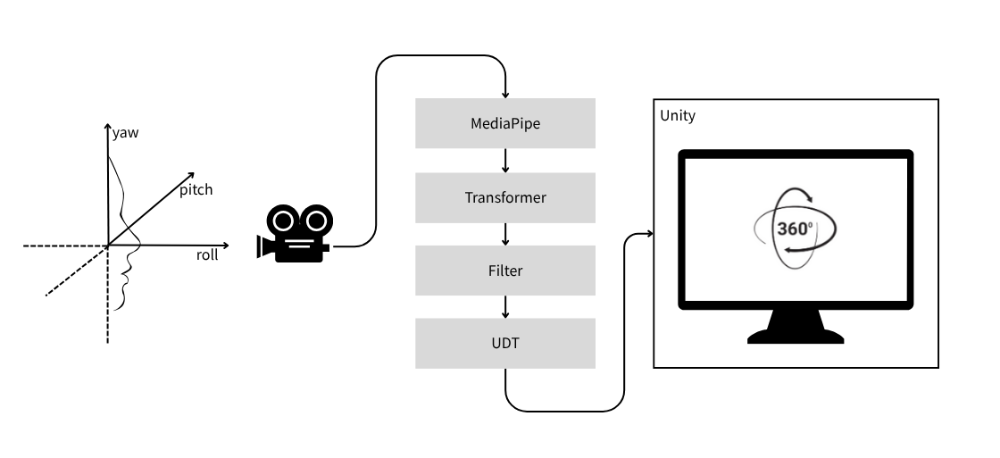
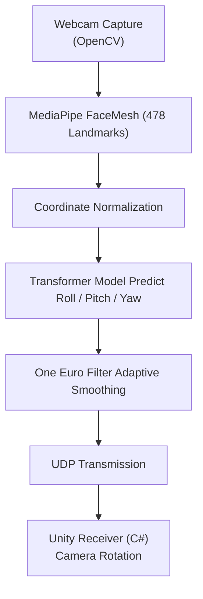
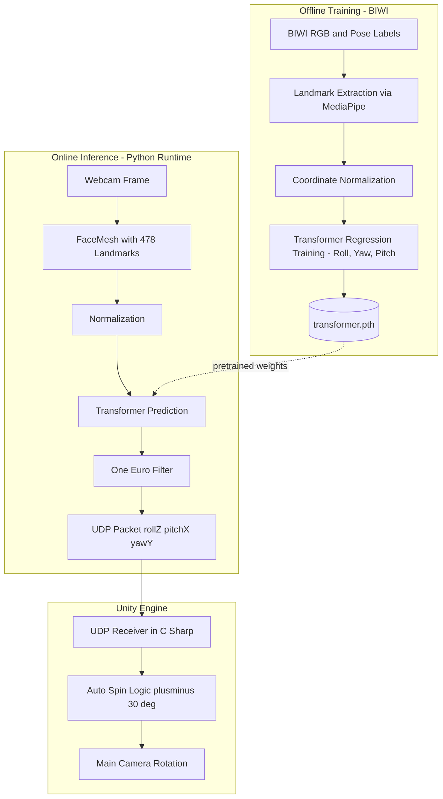
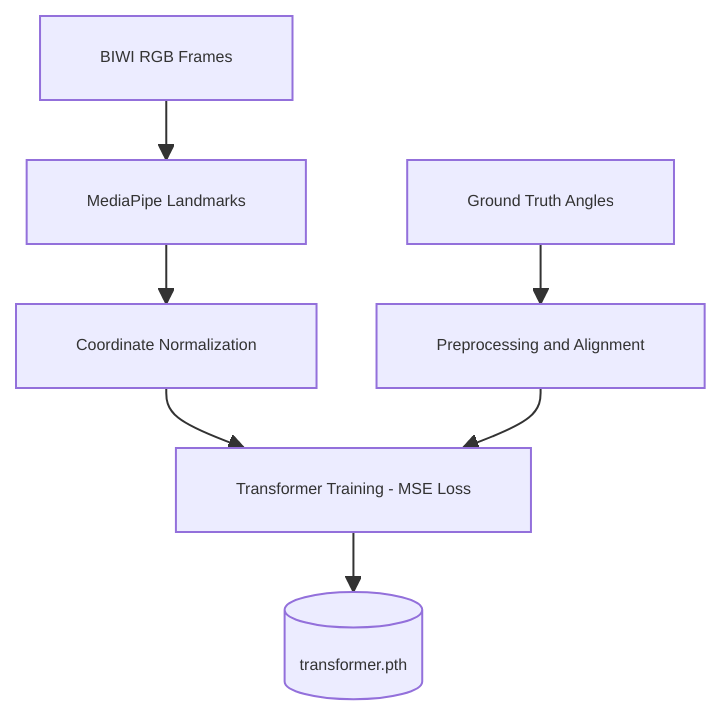

# Face Tracking for Semi-Immersive Virtual Reality  
**Seonghwan Lim, Department of Computer Science, Illinois Institute of Technology**

---


### Abstract

This project converts a **standard webcam** into a **real-time head-pose controller** for Unity, enabling a *semi-immersive virtual reality (VR)* experience without the need for head-mounted displays (HMDs), fiducial markers, or external sensors.  

Using **MediaPipe Face Landmarker**, the system extracts **478 facial landmarks** from live video and estimates **Euler angles (roll, pitch, yaw)** through a lightweight **Transformer-based regression model** trained on the **BIWI Kinect Head Pose Database**.  

To ensure stable and natural motion, the predicted angles are smoothed using the **One-Euro Filter** and transmitted via **UDP** to a Unity environment, where a C# script maps them to real-time camera rotations.  

This low-cost and portable configuration demonstrates that **marker-free, webcam-only head tracking** can approximate the responsiveness of professional VR hardware with latency below **10 ms**, making it suitable for rapid VR/AR prototyping, educational visualization, and interactive installations.  

> **Keywords:** Head-Pose Estimation · MediaPipe Face Landmarker · Transformer Regression · One-Euro Filter · Real-time Unity Integration · BIWI Kinect Dataset

---

## Project Overview

Conventional virtual-reality systems typically rely on **head-mounted displays (HMDs)** or specialized motion-tracking sensors, which are expensive and impractical for small laboratories, classrooms, or hobbyist applications.  
This study demonstrates that a **single, off-the-shelf webcam** can deliver a *semi-immersive VR experience*, enabling users to explore a 3D environment simply by moving their head.

The system continuously detects **3D facial landmarks** from a live webcam stream using **MediaPipe Face Landmarker**, predicts the user’s **Euler angles (roll, pitch, yaw)** through a compact **Transformer network**, and transmits the results to **Unity** in real time.  
Unity’s main camera rotates according to the user’s head motion, producing a natural “window-into-the-world” effect.

The proposed pipeline achieves smooth, low-latency head-pose control (≈ 10 ms) using only CPU inference, making it ideal for rapid **VR/AR prototyping**, **virtual classrooms**, and **interactive exhibitions**.

---

### System Concept Diagram

<p align="center">
  
  <br>
  <em>Figure 1. Overview of the proposed semi-immersive face-tracking VR system using a standard webcam.</em>
</p>

**Workflow Summary**

1. **Webcam Capture** → Live 720 p RGB feed  
2. **MediaPipe Face Mesh** → Extracts 478 3D facial keypoints  
3. **Transformer Model** → Regresses Euler angles *(roll, pitch, yaw)*  
4. **One-Euro Filter** → Smooths temporal jitter  
5. **UDP Transmission** → Sends three floating-point values to Unity  
6. **Unity C# Receiver** → Applies rotation to the Main Camera  

---

### Key Advantages
- **Low-cost and portable:** Operates on any standard laptop webcam  
- **Marker-free:** No fiducial markers or external tracking devices required  
- **Real-time:** End-to-end latency below 10 ms (CPU-only)  
- **Extensible:** Compatible with facial animation and avatar control systems  

---

## System Overview

The complete system integrates **Python** (for MediaPipe and Transformer-based estimation) with **Unity C#** (for rendering and visualization) via **UDP streaming**.  
Each component in the data pipeline is summarized below.

| Stage | Component | Description |
|--------|------------|-------------|
| **1. Capture** | Webcam | Captures 720 p / 30 FPS RGB frames. |
| **2. Landmark Extraction** | MediaPipe Face Mesh | Detects 478 three-dimensional facial landmarks. |
| **3. Pose Estimation** | Transformer Model | Predicts Euler angles *(roll, pitch, yaw)* from normalized landmarks. |
| **4. Temporal Filtering** | One-Euro Filter | Suppresses high-frequency jitter while maintaining responsiveness. |
| **5. Communication** | UDP Socket | Streams three floats — `rollZ, pitchX, yawY` — to Unity in real time. |
| **6. Rendering** | Unity (C# Script) | Rotates the main camera and applies an auto-spin safeguard beyond ± 30°. |

---

### End-to-End Data Flow


---

## Face Landmark Detection (MediaPipe)

The system employs **Google MediaPipe’s Face Landmarker Task** to obtain **478 3D facial landmarks** in real time.  
These landmarks provide rich geometric cues for accurately estimating head orientation (Euler angles).

| Feature | Description |
|----------|-------------|
| **Input types** | Still images, decoded video frames, or live webcam stream |
| **Outputs** | Face bounding box, 478 3D landmarks, 52 optional blendshape scores, and transformation matrices |
| **Model bundle** | (1) *BlazeFace Short-Range* — face detection<br>(2) *FaceMesh-V2* — dense 3D regression<br>(3) *Blendshape Predictor* — facial expressions |
| **Typical configuration (Python)** | `num_faces = 1`, `refine_landmarks = True`,<br>`min_face_detection_confidence = 0.5`, `min_tracking_confidence = 0.5` |
| **Running mode** | `LIVE_STREAM` (used in this project) |
| **Average performance** | ≈ 30 FPS on a 720 p webcam stream |

---

### Model Architecture

| Stage | Model | Purpose | Output |
|--------|--------|----------|--------|
| **1. Detection** | *BlazeFace Short-Range* | Locates the face bounding box | 6 coarse landmarks + box |
| **2. Regression** | *FaceMesh-V2* | Estimates dense facial geometry | 478 (x, y, z) landmarks |
| **3. Expression Estimation** | *Blendshape Model* | Computes 52 blendshape coefficients | Expression scores |
| **4. Transformation (optional)** | — | Aligns canonical to observed geometry | 4 × 4 matrix |

---

### Visualization

MediaPipe FaceMesh produces 478 landmarks across eyes, lips, and contours.  
Each landmark has normalized (x, y, z) coordinates.


*(Image source: Google MediaPipe Face Landmarker Guide.)*

---

## Training Dataset — BIWI Kinect Head Pose Database

The regression model was trained using the  
**[BIWI Kinect Head Pose Database](https://www.kaggle.com/datasets/kmader/biwi-kinect-head-pose-database/data)** (*Fanelli et al., IJCV 2013*), a benchmark dataset widely used for **3D head-pose estimation**.

| Property | Description |
|-----------|-------------|
| **Modality** | RGB + Depth (Kinect sensor) |
| **Resolution** | 640 × 480 pixels |
| **Frames** | ≈ 15 000 |
| **Subjects** | 20 (14 male, 6 female; 4 repeated) |
| **Setup** | ≈ 1 m distance; free head rotations |
| **Pose range** | Yaw ± 75°, Pitch ± 60° |
| **Annotations** | 3D head center and Euler angles |
| **Purpose** | Frame-by-frame pose estimation |
| **License** | Research use only |

Each subject folder includes synchronized RGB, depth, and annotation files:

```markdown
/<subject>/
 ├─ frame_XXXX_rgb.png        # RGB image (640×480)
 ├─ frame_XXXX_depth.png      # Depth map
 ├─ frame_XXXX_pose.txt       # 3×3 rotation R and 3D translation t
```

**Citation**

> Fanelli, G., Dantone, M., Gall, J., Fossati, A., & Van Gool, L.  
> *Random Forests for Real-Time 3D Face Analysis.*  
> *International Journal of Computer Vision* 101(3), 437–458 (2013).  
> DOI: 10.1007/s11263-012-0510-2  

---

## Key Modules

| File | Description |
|------|--------------|
| **filters.py** | Implements the *One-Euro Filter* (Casiez et al., CHI 2012) for adaptive smoothing of Euler-angle jitter. |
| **help.py** | Utility functions for coordinate normalization, rotation-matrix construction (`rotmat_zyx`), and visualization (`draw_axes`). |
| **transformer.py** | Three-layer, four-head Transformer encoder predicting (roll, yaw, pitch) from 478 landmarks. |
| **unity.py** | Python runtime: captures webcam frames, runs MediaPipe, infers angles, smooths with One-Euro filter, and streams UDP packets to Unity. |
| **unity_script/face_tracking.cs** | Unity C# receiver: listens for UDP packets, applies roll-pitch-yaw to camera rotation, and prevents gimbal flips beyond ± 30°. |

---

## End-to-End Pipeline



---

## Training Pipeline



---

## Performance Evaluation

| Metric | Result | Description |
|---------|---------|-------------|
| **Model Inference (CPU)** | ~ 1.2 ms / frame | Intel i7 laptop |
| **Total Latency** | < 10 ms | Includes MediaPipe + Transformer + UDP |
| **Unity Render Rate** | 30–60 FPS | Real-time rotation without drops |
| **Yaw Error (BIWI test)** | ± 3.5° | Mean absolute error |
| **Operational Range** | ± 75° yaw | Stable tracking with auto-spin protection |

The **One-Euro Filter** markedly reduces jitter while maintaining responsiveness.  
End-to-end system latency (capture → render) remains under 10 ms, enabling perceptually immediate feedback.

---

## Applications

| Domain | Example Use |
|---------|-------------|
| **Low-cost VR/AR Prototyping** | Rapid interface testing without HMDs |
| **Virtual Classrooms** | Shared semi-immersive learning perspectives |
| **Interactive Installations / Museums** | Natural user interaction in public displays |
| **3D Avatar Control** | Webcam-driven camera or rig manipulation |

---

## Project Directory Structure

```markdown
project_root/
├─ python/
│  ├─ filters.py              # Adaptive One-Euro filter
│  ├─ help.py                 # Normalization / rotation utilities
│  ├─ transformer.py          # Transformer encoder for pose regression
│  ├─ unity.py                # Real-time inference and UDP streaming
│  └─ model/
│     └─ transformer.pth      # Pretrained weights (BIWI)
│
├─ unity_script/
│  └─ face_tracking.cs        # Unity UDP receiver for camera rotation
│
├─ figures/
│  └─ overview_concept.png
│
├─ recording.gif              # Demonstration animation
└─ README.md                  # Project documentation
```

---

## References

**Fanelli, G., Dantone, M., Gall, J., Fossati, A., & Van Gool, L.**  
*Random Forests for Real-Time 3D Face Analysis.* *International Journal of Computer Vision*, 101(3), 437–458 (2013). DOI 10.1007/s11263-012-0510-2  

**Casiez, G., Roussel, N., & Vogel, D.**  
*The One Euro Filter: A Simple Speed-Based Low-Pass Filter for Noisy Input in Interactive Systems.* *Proceedings of CHI 2012*, 2527–2530.  

**Google Research.** *MediaPipe Face Landmarker Guide.* <https://ai.google.dev/edge/mediapipe/solutions/vision/face_landmarker>  

**Unity Technologies.** *UDP Networking and Transform APIs,* Unity Documentation.